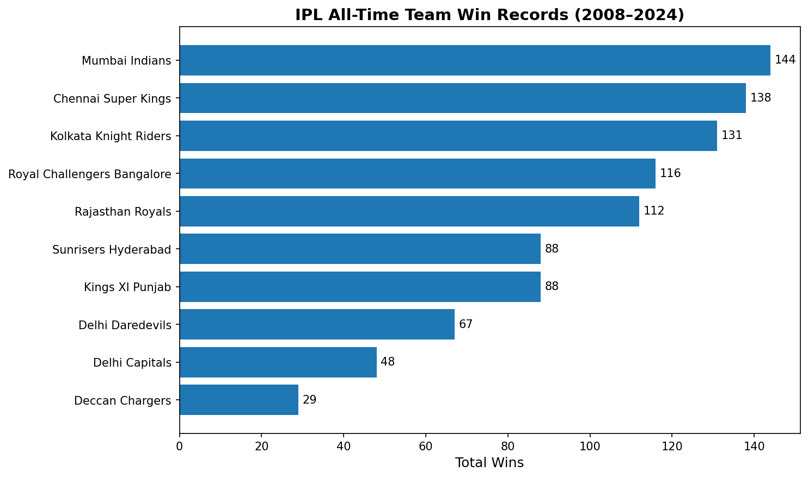
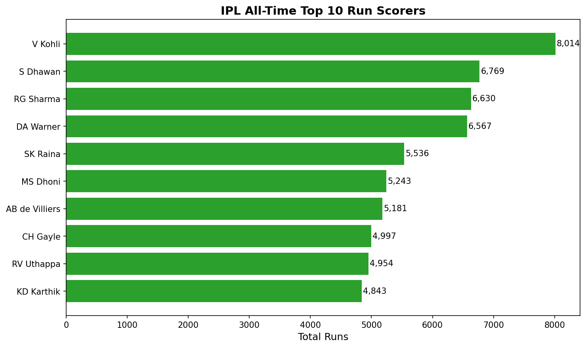
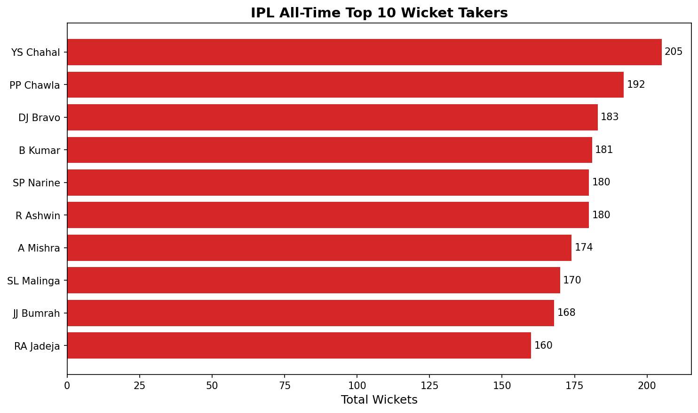
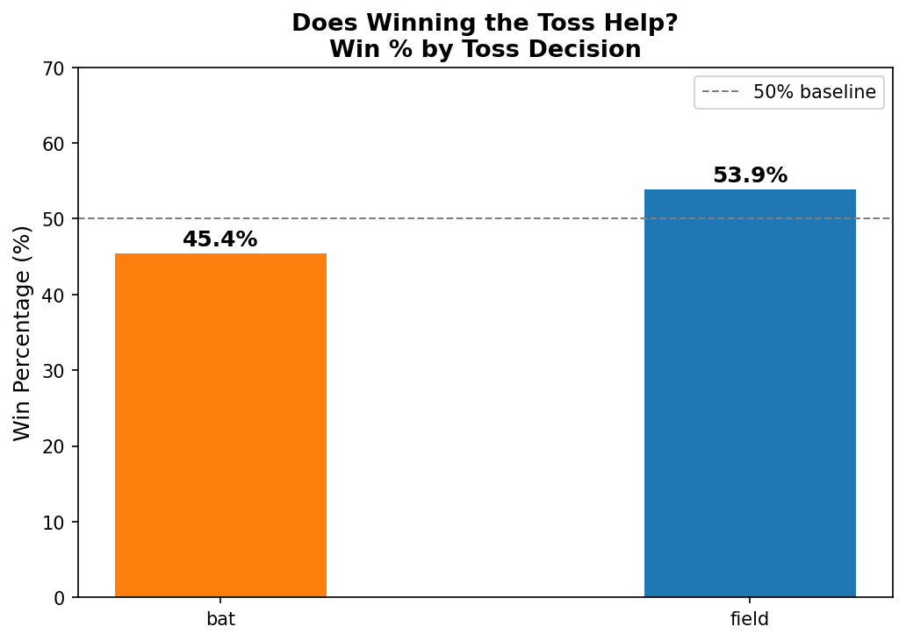
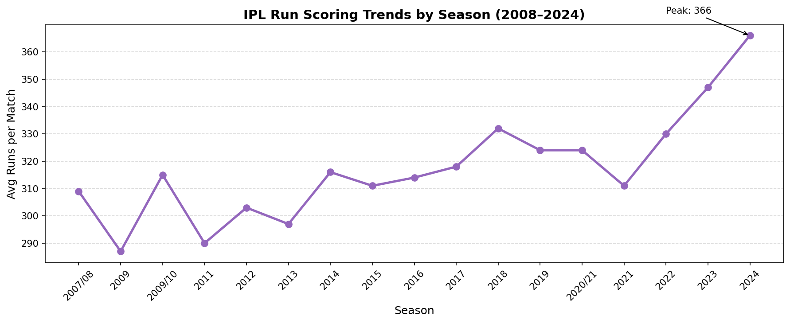

# IPL Data Pipeline — End-to-End Python & SQL Project


## Project Overview

An end-to-end data pipeline built on 17 seasons of IPL match data (2008–2024).
This project simulates a real-world ETL workflow — from raw CSV ingestion through
cleaning, transformation, SQL analysis, and insight visualisation.

---

## Pipeline Architecture
```
Raw CSV Files
(matches.csv, deliveries.csv)
        │
        ▼
┌───────────────────┐
│   EXTRACT         │  pandas read_csv()
│   Load raw data   │
└───────────────────┘
        │
        ▼
┌───────────────────┐
│   TRANSFORM       │  Clean nulls, fix dtypes,
│   Clean & enrich  │  add derived columns
└───────────────────┘
        │
        ▼
┌───────────────────┐
│   LOAD            │  SQLite database
│   Structured DB   │  (ipl_database.db)
└───────────────────┘
        │
        ▼
┌───────────────────┐
│   ANALYSE         │  5 SQL queries
│   Insights + viz  │  5 Matplotlib charts
└───────────────────┘
```

---

## Tech Stack

| Tool | Purpose |
|---|---|
| Python 3.x | Core scripting and pipeline logic |
| Pandas | Data ingestion, cleaning, transformation |
| SQLite | Structured storage and SQL querying |
| Matplotlib | Data visualisation |
| Jupyter Notebook | Interactive development environment |

---

## Dataset

- Source: [IPL Complete Dataset 2008–2024 — Kaggle](https://www.kaggle.com/datasets/patrickb1912/ipl-complete-dataset-20082020)
- Files: `matches.csv` (1,095 rows) and `deliveries.csv` (260,920 rows)
- Total runs in dataset: 347,756

---

## Key Findings

| Insight | Finding |
|---|---|
| Most successful team | Mumbai Indians (144 wins) |
| All-time top run scorer | V Kohli — 8,014 runs (SR: 128.51) |
| All-time top wicket taker | YS Chahal — 205 wickets |
| Toss impact — field first | 53.9% win rate |
| Toss impact — bat first | 45.4% win rate |
| Run scoring trend | Avg runs/match grew from 309 (2008) to 366 (2024) |

---

## Visualisations

### Team Win Records


### Top Run Scorers


### Top Wicket Takers


### Toss Impact


### Season Run Trends


---

## Project Structure
```
ipl-data-pipeline/
│
├── matches.csv                  # Raw match data
├── deliveries.csv               # Raw ball-by-ball data
├── requirements.txt             # Python dependencies
│
├── notebooks/
│   └── ipl_pipeline.ipynb      # Full pipeline notebook
│
└── output/
    ├── matches_clean.csv        # Cleaned matches data
    ├── deliveries_clean.csv     # Cleaned deliveries data
    ├── ipl_database.db          # SQLite database
    ├── team_wins.csv            # Query result
    ├── top_batters.csv          # Query result
    ├── top_bowlers.csv          # Query result
    ├── toss_analysis.csv        # Query result
    ├── season_stats.csv         # Query result
    ├── chart1_team_wins.png     # Visualisation
    ├── chart2_top_batters.png   # Visualisation
    ├── chart3_top_bowlers.png   # Visualisation
    ├── chart4_toss_impact.png   # Visualisation
    └── chart5_season_trends.png # Visualisation
```

---

## How to Run
```bash
# 1. Clone the repository
git clone https://github.com/YOUR_USERNAME/ipl-data-pipeline.git
cd ipl-data-pipeline

# 2. Create and activate virtual environment
python -m venv venv
venv\Scripts\activate  # Windows
source venv/bin/activate  # Mac/Linux

# 3. Install dependencies
pip install -r requirements.txt

# 4. Launch Jupyter Notebook
jupyter notebook

# 5. Open notebooks/ipl_pipeline.ipynb and run all cells
```

---

## What I Learned

- Designing a structured ETL pipeline from scratch
- Handling real-world data quality issues (missing values, schema differences)
- SQL data modelling and analytical query writing
- Translating raw data into meaningful business insights

---

*Built by Manish Patil — Final Year IT Engineering Student, SPPU*
*Connect with me on [LinkedIn](https://www.linkedin.com/in/manish-patil-009389321)*
